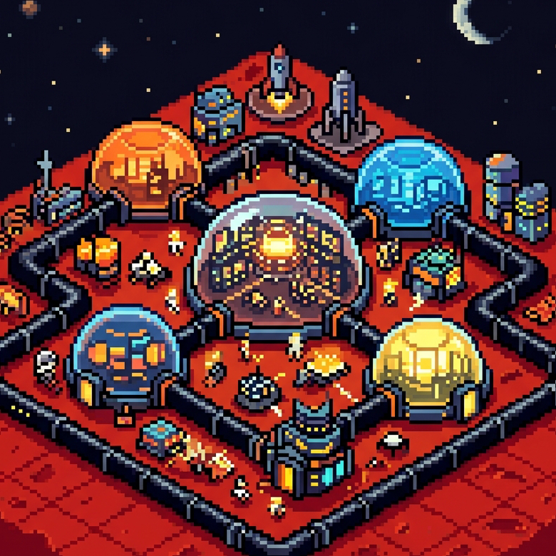

# SpaceCity: Mars Colony Simulator

<p align="center">
  
</p>


SpaceCity is a deeply strategic, SimCity-inspired Mars colony simulator, **built entirely by Google's Gemini AI**. Build your starting Landing Base, connect it to Power Plants via Power Lines, and zone out Residential, Commercial, and Industrial sectors while managing crime, health, and a dynamic economy!

## Features

- **Procedural Generation**: Terrain generates uniquely on every start.
- **Dynamic RCI Economy**: Residential, Commercial, and Industrial zones depend on each other for workforce and customers.
- **In-Depth Pathfinding**: The Simulation Engine dynamically maps traffic, calculates commute routes, and applies gridlock penalties to overused transit tubes.
- **Macro and Micro Zoning**: Plop massive 3x3 Mega-Structures or place 1x1 infrastructure nodes.
- **Rich City Services**: Build Hospitals, Police Stations, and Maintenance Depots to keep your citizens healthy, safe, and buildings from breaking down.
- **Autonomous Drones & Launchpads**: Expand your transit network wirelessly using advanced orbital and drone-based networks.
- **Interactive UI & Advisor**: Track your city's funds, population, and demands via the live UI and listen to the City Advisor's alerts.
- **Custom Viewport Engine**: Highly optimized, gesture-supporting native PixiJS camera engine with zoom limits and bounds-checking.

## Technology Stack

- **Core**: TypeScript, HTML5, Vanilla CSS
- **Rendering**: PixiJS v8 
- **Build Tool**: Vite
- **Testing**: Vitest & JSDOM (Near 100% Core Engine Coverage)
- **CI/CD**: GitHub Actions & GitHub Pages

## Quick Start

### Install Dependencies
```bash
npm install
```

### Start Development Server
```bash
npm run dev
```

### Run Tests
```bash
npm run test:coverage
```

### Build for Production
```bash
npm run build
```

## How to Play

1. Start by building a **Power Plant** and connecting it via **Power Lines** to your starting base.
2. Build **Transit Tubes** to expand your colony's reach.
3. Zone **Residential** habitats for citizens to move in.
4. Zone **Industrial** and **Commercial** areas to generate jobs, but ensure citizens can commute to them via Transit Tubes!
5. Manage your **Budget** carefully and provide basic city services to prevent your colony from collapsing.

Happy building, Mayor!
